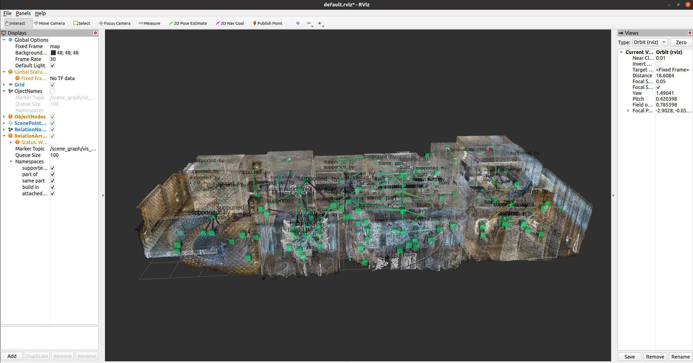

# SceneGraphNav
## Installation 
### System setup: Ros
Please make sure you have installed [ros-xxx-desktop-full](http://wiki.ros.org/ROS/Installation) package in your computer. Only `ros-noetic-desktop-full` on `Ubuntu 20.04` tested. For installation of ros-noetic, please refer to [this page](http://wiki.ros.org/noetic/Installation/Ubuntu). 

### Pytorch and PyG Setup

Install [Pytorch](https://pytorch.org/get-started/previous-versions/) and [PyG (PyTorch Geometric)](https://pytorch-geometric.readthedocs.io/en/latest/notes/installation.html). Specifically, you can run the following script to install Pytorch 1.8.0+cuda11.1 and corresponding PyG.  

```
# Anaconda
conda create -n sg_nav python=3.8
conda activate sg_nav
# Pytorch
conda install pytorch==1.8.0 torchvision==0.9.0 torchaudio==0.8.0 cudatoolkit=11.1 -c pytorch -c conda-forge
# Pytorch Geometric
conda install pyg -c pyg -c conda-forge
``` 
or with pip (not recommended for some unknown errors): 
```
# Pytorch
pip install torch==1.8.0+cu111 torchvision==0.9.0+cu111 torchaudio==0.8.0 -f https://download.pytorch.org/whl/torch_stable.html

# Pytorch Geometric
export TORCH=1.8.0
export CUDA=cu111
pip install torch-scatter -f https://data.pyg.org/whl/torch-$TORCH+$CUDA.html
pip install torch-sparse -f https://data.pyg.org/whl/torch-$TORCH+$CUDA.html
pip install torch-cluster -f https://data.pyg.org/whl/torch-$TORCH+$CUDA.html
pip install torch-spline-conv -f https://data.pyg.org/whl/torch-$TORCH+$CUDA}.html
pip install torch-geometric
``` 

### Habitat environment setup 
Install [habitat-sim](https://github.com/facebookresearch/habitat-sim#installation) and [habitat-lab](https://github.com/facebookresearch/habitat-lab#installation) in a conda environment or directly install them in the default python library.

**(Recommended Installation)**

Here is the installation scripts tested on Ubuntu 20.04 with single GPU and an attached display:
```
conda install habitat-sim -c conda-forge -c aihabitat
git clone --branch stable https://github.com/facebookresearch/habitat-lab.git
cd habitat-lab
pip install -r requirements.txt
python setup.py develop --all 
```
Installation may fail if tensorflow is not installed correctly, run:
```
pip install --upgrade https://storage.googleapis.com/tensorflow/mac/cpu/tensorflow-1.13.1-py3-none-any.whl
```
For the full installation options and post-installation tests, please refer to the original repositories. 

### Other Python dependencies
You can install python dependencies with 
```
# change to the repository root directory first
pip install -r requirements.txt
```

## Data Process
### Generate vertex surface normals and instance segmentation
- Change `scan_dir` parameter in `parse_args()` function to your local path or use `--scan_dir` argument. 
- For testing, use argument `--scene_name "17DRP5sb8fy"`. Then the script only generates data for scene `17DRP5sb8fy`.
```
# only generate data for scene 17DRP5sb8fy
python -m dataset.habitat.process_data --scan_dir  <YOUR_LOCAL_PATH> --scene_names 17DRP5sb8fy
# generate data for all scenes in <YOUR_LOCAL_PATH>
python -m dataset.habitat.process_data --scan_dir  <YOUR_LOCAL_PATH> 
```
### Generate geodesic distance map and shortest paths
This process is very slow. ~3 min for each one-level scene (on i7-10700K + RTX 3080).

TODO LIST: 
- parallelize this process.  
- integrate into data process
```
# only generate data for scene 17DRP5sb8fy
python -m dataset.habitat.process_data --scan_dir  <YOUR_LOCAL_PATH> --scene_names 17DRP5sb8fy
# generate data for all scenes in <YOUR_LOCAL_PATH>
python -m dataset.habitat.process_data --scan_dir  <YOUR_LOCAL_PATH> 
```
## Run 
### Non-interactive Demo
Not finished yet. It is only a script to test correctness for now.
```
python demo_scene_graph.py
```
### ROS Demo 
Please make sure you have started ROS core before running this demo. You can simply start ROS core with command:
```
roscore
``` 
Since this is not a ros package, you do not need to run `./devel/setup.sh` to activate ros package env.

Please first change the path to `./vis_ros/config/default.rviz` file according to your system. Then run
```
bash ./vis_ros_script.sh
```
If you installed all dependencies correctly, you can see the demo as shown below:

## Data Format
Please refer to [this file](./DataFormat.md).
